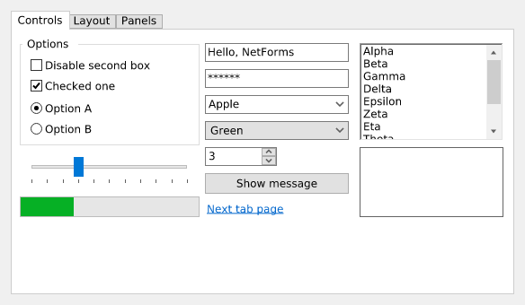
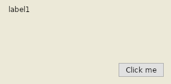

<p align="center"></p>

<h1 align="center">NetForms</h1>

<p align="center"><b>Windows Forms для Windows и Linux.</b><br>
<a href="https://go-forms.github.io/.NetForms/ru/"><b>Сайт</b></a> ·
<a href="https://go-forms.github.io/.NetForms/ru/docs/">Документация</a> ·
<a href="https://go-forms.github.io/.NetForms/ru/docs/install.html">Установка</a> ·
<a href="README.md">English</a></p>

<p align="center">
<a href="https://github.com/Go-Forms/.NetForms/actions/workflows/ci.yml"></a>
<a href="https://www.nuget.org/packages/NetForms"></a>
<a href="LICENSE"></a>
</p>

Тот же API `System.Windows.Forms`, те же `Program.cs` / `MainForm.cs` / `MainForm.Designer.cs`, тот же
порядок работы с дизайнером — на .NET 10, с одинаковой отрисовкой на обеих системах через SkiaSharp и
Avalonia в роли платформенного слоя.

```diff
-    <TargetFramework>net8.0-windows</TargetFramework>
-    <UseWindowsForms>true</UseWindowsForms>
+    <TargetFramework>net10.0</TargetFramework>
+    <PackageReference Include="NetForms" Version="0.1.0-preview.6" />
```

Для большинства проектов это и есть весь перенос — код не меняется. `netforms-convert` сделает это за вас,
включая проекты .NET Framework.

| Витрина контролов — одни и те же пиксели на Windows и Linux | Проект WinForms из Visual Studio после `netforms-convert`, запущенный на Linux |
|---|---|
|  |  |

## Как получить

Всё берётся из NuGet.

```sh
# новое приложение
dotnet new install NetForms.Templates::0.1.0-preview.6
dotnet new netforms -n MyApp && cd MyApp && dotnet run

# готовое WinForms-приложение
dotnet tool install -g NetForms.Convert --prerelease
netforms-convert MyApp.csproj --apply
```

Нужен .NET 10 SDK, на Linux — несколько системных библиотек. Пошагово для Windows, Ubuntu, Debian, Fedora,
Astra Linux, РЕД ОС и ALT: **[Установка и настройка](https://go-forms.github.io/.NetForms/ru/docs/install.html)**.

Визуальный дизайнер: **NetForms Designer** для VS Code (Marketplace и Open VSX) — см. [designer/](designer/README.md).


## Документация

На сайте: **<https://go-forms.github.io/.NetForms/ru/docs/>**. Справочник по API — от Microsoft,
<https://learn.microsoft.com/ru-ru/dotnet/desktop/winforms/>: NetForms — его копия. Собственные страницы
NetForms (тот же Markdown лежит в [docs/ru/](docs/ru/README.md)):

- [Установка и настройка](https://go-forms.github.io/.NetForms/ru/docs/install.html)
- [Первое приложение](https://go-forms.github.io/.NetForms/ru/docs/getting-started.html)
- [Перевод WinForms-проекта](https://go-forms.github.io/.NetForms/ru/docs/migrating.html)
- [Совместимость](https://go-forms.github.io/.NetForms/ru/docs/compatibility.html) — версии .NET, ОС, состояние каждого контрола, чего нет
- [Покрытие API](https://go-forms.github.io/.NetForms/docs/api/) — генерируется автоматически, по типам (англ.)
- [Визуальный дизайнер](https://go-forms.github.io/.NetForms/ru/docs/designer.html)

## Состояние

Предварительная версия. Измерено, а не на глаз:

- **API:** из 1254 публичных типов `System.Windows.Forms` + `System.Drawing.Common` 664 — полные,
  163 — частично, 427 — нет ([покрытие](docs/api/README.md)).
- **Поведение:** 415/415 тестов; раскладка, порядок событий, метрики текста и то, что пишет дизайнер,
  сверяются с настоящим WinForms на Windows, отрисовка проверяется без окна на обеих ОС.
- **Реальные проекты:** 7 из 7 проектов заказчика на .NET Framework и 28 из 45 открытых WinForms-проектов
  переводятся и собираются без ручных правок.
- Пока нет: печати, специальных возможностей, перетаскивания, `WebBrowser`, тёмной темы, сторонних пакетов
  контролов из NuGet.

## Репозиторий

```
src/NetForms                  System.Windows.Forms: Control, Form, Application, контролы
src/NetForms.Drawing          System.Drawing на SkiaSharp
src/NetForms.Platform*        платформенный слой (Avalonia 12)
src/NetForms.Design*          хост дизайнера: чтение и запись InitializeComponent через Roslyn
designer/                     расширение VS Code
templates/                    шаблоны dotnet new (пакет NuGet NetForms.Templates)
tools/NetForms.Convert        конвертер WinForms → NetForms (netforms-convert)
tests/                        golden-отрисовка, поведение, дифф-тесты против WinForms, корпус
site/                         сайт; docs/ собирается в него
docs/PLAN.md                  архитектура, дорожная карта, журнал решений
```

Сборка и тесты: `dotnet test NetForms.slnx`; расширение: `cd designer && npm ci && npm test`; сайт:
`cd site && npm ci && npm run build`. Выпуск происходит, когда в `main` меняется `<Version>`:
[docs/RELEASING.md](docs/RELEASING.md).

Лицензия MIT — см. [LICENSE](LICENSE) и [THIRD-PARTY-NOTICES.md](THIRD-PARTY-NOTICES.md).
