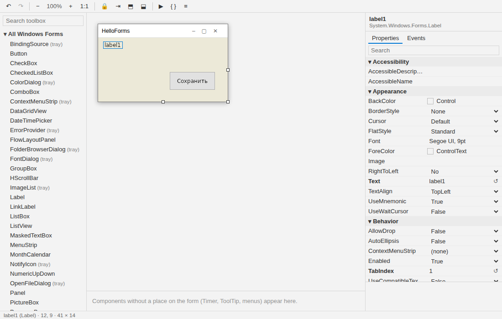

# The visual designer

The NetForms designer is a VS Code extension: **NetForms Designer** (`netforms.netforms-designer`).
It is the Windows Forms designer of Visual Studio rebuilt for VS Code, on Windows and Linux, and it works
fully offline.

## How it works

- `*.Designer.cs` opens as a canvas (use **Open as Text** in the editor title to see the code). F7 goes to
  `MainForm.cs`, Shift+F7 back.
- The form on the canvas is painted by NetForms itself — a design-time host (`tools/NetFormsDesigner.Host`,
  bundled in the extension) reads `InitializeComponent()` with Roslyn **without compiling your project**,
  builds the live form and sends a picture to the webview.
- Every edit is written back to `*.Designer.cs` in the form Visual Studio writes (same statement order,
  same comments, same `ShouldSerialize` rules — checked against the real WinForms serializer in CI). A form
  saved here opens in Visual Studio unchanged and vice versa. The file is the only source of truth: edit
  it as text or switch branches, and the canvas reloads.
- Renaming a control renames its field, its event handlers and their uses in your code.

The full feature list, commands and settings are on the extension page:
[designer/README.md](../designer/README.md).

## Not yet

- Writing `.resx`: a new image picked in the property grid, editing a `Localizable = true` form (such forms
  open read-only with an explanation).
- Extender properties (`ToolTip on toolTip1`, `Error on errorProvider1`) in the property grid — they are
  kept in the file, just not shown.
- A theme editor.

## Language

The interface follows the VS Code display language: English or Russian. Toolbox groups and property
categories are named as in the Russian Visual Studio; property descriptions come from WinForms and stay in
English.
