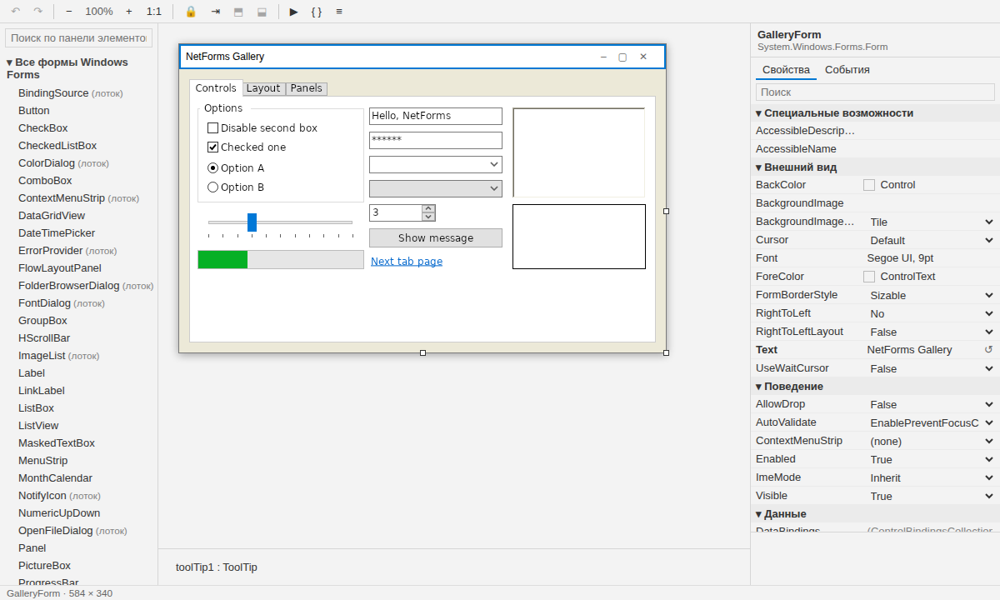

# Визуальный дизайнер

Дизайнер NetForms — это расширение VS Code **NetForms Designer** (`netforms.netforms-designer`). Это
дизайнер Windows Forms из Visual Studio, заново сделанный для VS Code, на Windows и Linux. Правка форм
работает полностью без сети; создание проектов и форм использует шаблоны NetForms из NuGet.

Как поставить его и VS Code: [Установка и настройка](install.md#4-vs-code-и-дизайнер).

## Как это устроено

- `*.Designer.cs` открывается холстом (**Open as Text** в заголовке редактора показывает код). F7 — переход в
  `MainForm.cs`, Shift+F7 — обратно.
- Форму на холсте рисует сам NetForms: хост времени разработки (`tools/NetFormsDesigner.Host`, входит в
  расширение) читает `InitializeComponent()` через Roslyn **без компиляции вашего проекта**, строит живую форму
  и отдаёт картинку в webview.
- Каждая правка записывается обратно в `*.Designer.cs` так, как пишет Visual Studio (тот же порядок операторов,
  те же комментарии, те же правила `ShouldSerialize` — это сверяется с настоящим сериализатором WinForms в CI).
  Форма, сохранённая здесь, без изменений открывается в Visual Studio, и наоборот. Единственный источник
  истины — файл: правьте его как текст или переключайте ветки, холст перечитается.
- Переименование контрола переименовывает поле, обработчики событий и их использования в вашем коде.
- **Вкладка «События»:** **+** рядом с событием пишет обработчик с именем по умолчанию (`button1_Click`) в
  `MainForm.cs` и открывает его — так же, как двойной щелчок по событию (или по контролу — для его события по
  умолчанию); ввод имени и Enter привязывают обработчик со своим именем. **→** — переход к обработчику, **✕** —
  отвязать (метод остаётся в коде, как в Visual Studio).

## Создание проектов и форм

**NetForms: Create New Project…** и **NetForms: New Form…** (есть и в контекстном меню папки в проводнике)
запускают `dotnet new` с пакетом **NetForms.Templates**. В первый раз расширение ставит из NuGet ту версию
шаблонов, для которой оно сделано (`dotnet new install NetForms.Templates::<версия>`); новый проект ссылается на
пакет **NetForms** той же версии. Новая форма получает пространство имён проекта плюс папки, как в Visual Studio,
и открывается на холсте.

## Команды

| Команда | Клавиша | Что делает |
|---|---|---|
| NetForms: Open Visual Designer | | Открывает `*.Designer.cs` (или форму текущего `.cs`) на холсте. |
| NetForms: Open as Text | | Тот же файл в текстовом редакторе. |
| NetForms: View Code | F7 | С холста в `MainForm.cs`. |
| NetForms: View Designer | Shift+F7 | Из `MainForm.cs` на холст. |
| NetForms: Tidy Designer File | | Переписывает `InitializeComponent()` в каноническом виде, в котором его пишет дизайнер, убирая лишнее. |
| NetForms: Create New Project… | | Новое приложение NetForms (см. выше). |
| NetForms: New Form… | | Форма или пользовательский контрол в папке. |
| NetForms: Convert WinForms Project… | | Отчёт конвертера для `.csproj`, затем правка ([Перевод WinForms-проекта](migrating.md)). |
| NetForms: Run Project | | `dotnet run` в терминале. |
| NetForms: Set Designer Host Path… | | Использовать другой хост дизайнера. |
| NetForms: Check Setup | | Показывает найденные `dotnet`, хост дизайнера и шаблоны. |

Отладка (F5) — от расширения C#: его команда **.NET: Generate Assets for Build and Debug** создаёт `launch.json`.

## Настройки

| Настройка | По умолчанию | |
|---|---|---|
| `netforms.dotnetPath` | `dotnet` | Исполняемый файл `dotnet`, если его нет в `PATH`. |
| `netforms.designerHostPath` | пусто | Другой хост дизайнера (`NetFormsDesigner.Host.dll`); пусто — встроенный в расширение. |
| `netforms.snapToLines` | вкл. | Привязка к краям, центрам и отступам при перетаскивании (Alt — двигать свободно). |

## Холст

Перемещение и изменение размера мышью или стрелками (Ctrl — по 8, Shift — размер), линии привязки, выбор
нескольких с Ctrl/Shift, Escape выбирает родителя, перенос в другой контейнер, Формат → Выровнять / Сделать
одинаковыми / Интервалы, масштаб, блокировка, на передний / задний план, режим порядка обхода (щёлкайте по
контролам по порядку). Докнутые контролы обведены пунктиром и тянутся только за свободную кромку, как в Visual
Studio. Компоненты без места на форме (Timer, ToolTip, ImageList, меню, диалоги) попадают в лоток под формой.
Отмена и повтор — Ctrl+Z / Ctrl+Y внутри холста.

## Пока нет

- Записи `.resx`: новой картинки из панели свойств, правки формы с `Localizable = true` (такие формы открываются
  только для чтения с объяснением).
- Свойств-расширителей («ToolTip на toolTip1», «Error на errorProvider1») в панели свойств — они сохраняются в
  файле, просто не показываются.
- Редактора темы.

## Язык

Интерфейс следует языку VS Code: английский или русский. Группы панели элементов и категории свойств названы
как в русской Visual Studio; описания свойств берутся из WinForms и остаются на английском.
